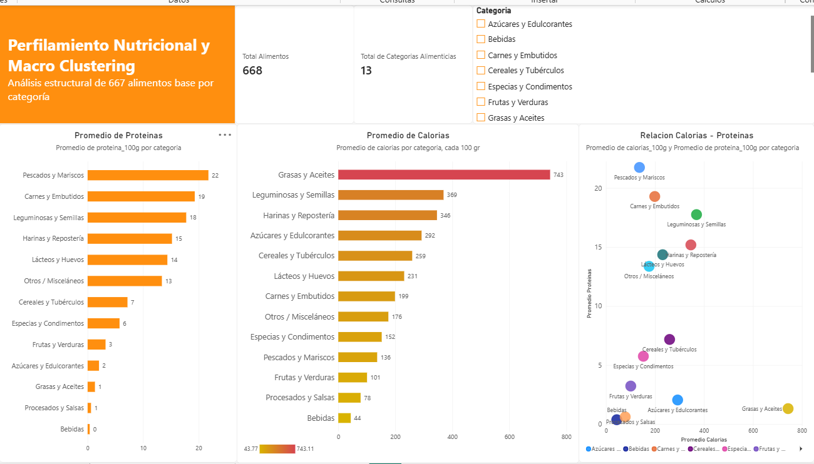
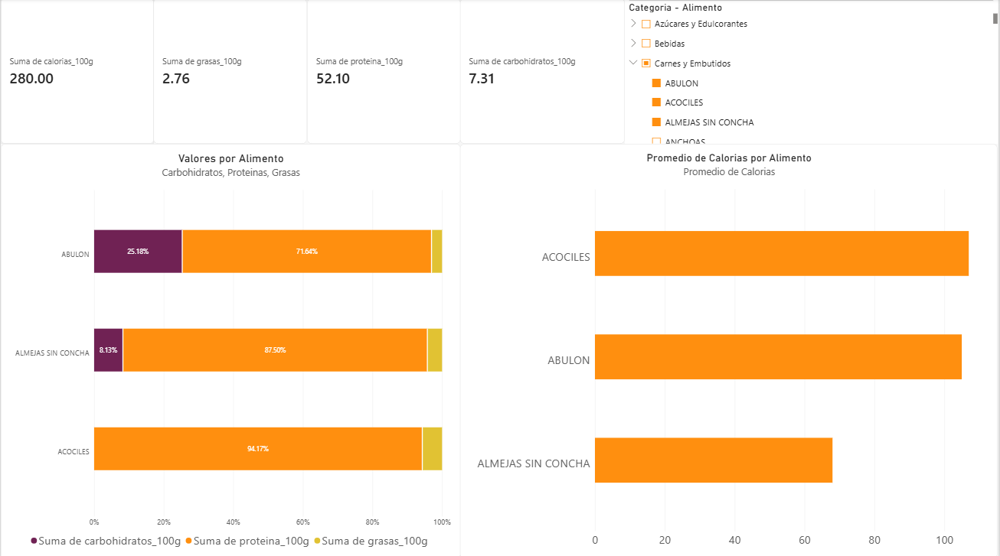

# 🥗 Análisis Nutricional de Alimentos

Análisis exploratorio de la composición nutricional de **667 alimentos**, utilizando datos de composición por cada 100 g para identificar diferencias entre categorías y comparar perfiles de macronutrientes.

El proyecto integra **Excel, Google BigQuery, SQL y Power BI**, cubriendo distintas etapas del proceso de análisis de datos: preparación y estructuración de información, consulta y análisis mediante SQL, y visualización de resultados en un dashboard interactivo.

## 🎯 Objetivo

Analizar la composición nutricional de los alimentos para identificar:

* Diferencias nutricionales entre categorías.
* Distribución de calorías, proteínas, carbohidratos y grasas.
* Alimentos con mayor contenido calórico.
* Diferencias en el perfil de macronutrientes entre alimentos.

## 📊 Dashboard

### Página 1 — Macro Overview

Vista general del perfil nutricional de los alimentos, con indicadores y visualizaciones para comparar categorías y analizar la composición de macronutrientes.



### Página 2 — Ingredient Finder

Herramienta de exploración que permite seleccionar y comparar alimentos, mostrando sus valores nutricionales y la proporción de proteínas, carbohidratos y grasas.



## 🔎 Análisis SQL

Las consultas realizadas en **Google BigQuery** incluyen:

1. Cantidad de alimentos por categoría.
2. Promedio de calorías y macronutrientes por categoría.
3. Top 5 de alimentos con mayor contenido calórico por categoría.
4. Top 20 de alimentos con mayor contenido calórico.

[Ver consultas SQL](sql/analisis_nutricional.sql)

## 🗂️ Datos

El conjunto de datos contiene información nutricional de alimentos, principalmente expresada por cada **100 g**.

Principales variables:

* `id_alimento`
* `nombre_alimento`
* `categoria`
* `unidad_base`
* `peso_unitario_g`
* `calorias_100g`
* `proteina_100g`
* `carbohidratos_100g`
* `grasas_100g`

[Ver conjunto de datos](data/alimentos_info.xlsx)

## 🛠️ Tecnologías

* **Excel** — limpieza y estructuración de datos.
* **Google BigQuery** — almacenamiento y consulta de datos.
* **SQL** — análisis y transformación de información.
* **Power BI** — modelado, medidas DAX y visualización interactiva.

## 📁 Estructura del proyecto

```text
Analisis-Nutricional-Macro-Clustering/
│
├── README.md
├── sql/
│   └── analisis_nutricional.sql
├── data/
│   └── alimentos_info.xlsx
└── screenshots/
    ├── imagen_1.png
    └── imagen_2.png
```

## 📚 Fuente de datos

Los datos se basan en registros públicos de composición de alimentos del **Instituto Nacional de Salud Pública (INSP)**.

Fuente: [INSP — BAM (Base de Alimentos de México)](https://insp.mx/informacion-relevante/bam-bienvenida)

